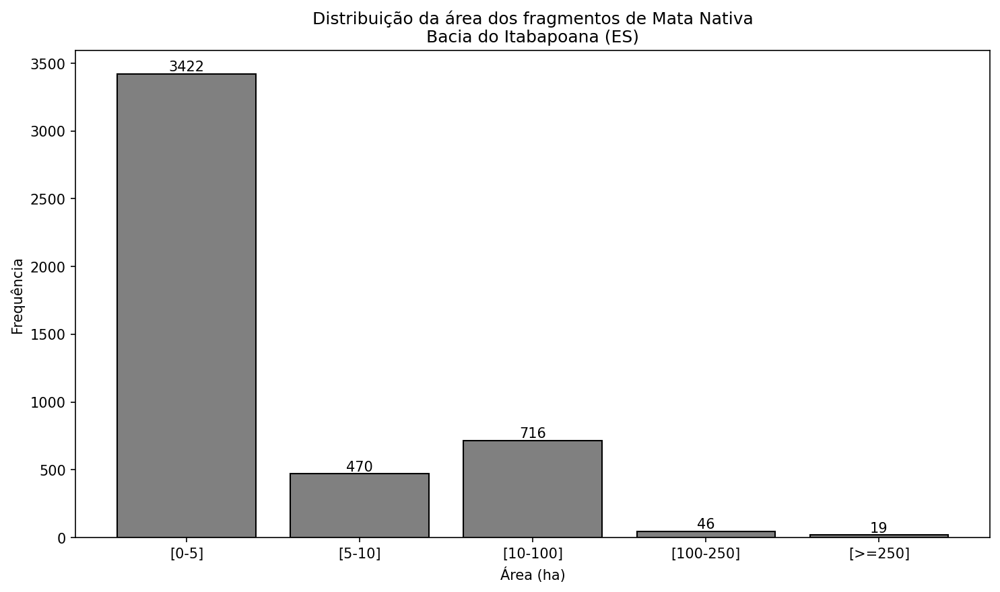
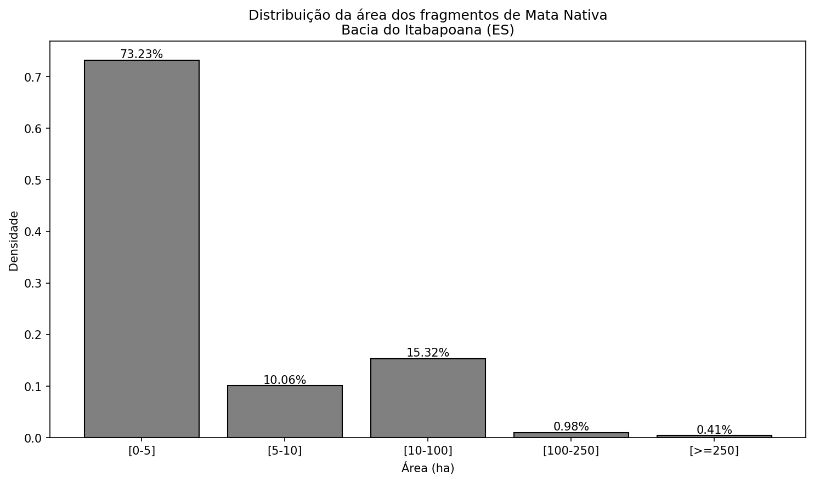

# Roteiro — Ecologia da Paisagem da Bacia do Itabapoana

Guia do que foi feito no projeto e onde encontrar cada resultado.

---

## Visão geral

| Item | Descrição |
|------|-----------|
| **Objetivo** | Analisar a Ecologia da Paisagem da Bacia do Itabapoana (ES) |
| **Foco** | Fragmentos de Mata Nativa e Mata Nativa em Estágio Inicial de Regeneração |
| **CRS** | SIRGAS 2000 / UTM 24S (EPSG:31984) |
| **Documentação** | `fontes-dados.md` · `nomenclatura.md` · `referencias.md` |

---

## Roteiro — O que foi feito

### Etapa 1. Estruturação do repositório ✅

**O que foi feito:** Criação da estrutura de pastas do projeto.

**Onde está:**
```
Ecologia_Paisagem/
├── docs/          → Documentação
├── Dados/         → Dados geográficos
├── scripts/       → Código de análise
├── resultados/    → Outputs
└── figuras/       → Figuras para publicação
```

**Configuração do Git LFS (arquivos GIS grandes):**

Para versionar arquivos geográficos sem exceder o limite do GitHub (100 MB por arquivo), o projeto usa Git LFS (Large File Storage).

**Requisitos:** Git LFS instalado (`winget install GitHub.GitLFS` no Windows).

**Passos:**
1. Na raiz do repositório: `git lfs install`
2. Definir os tipos de arquivo trackeados:
   ```bash
   git lfs track "*.gpkg"
   git lfs track "*.shp"
   git lfs track "*.shx"
   git lfs track "*.dbf"
   git lfs track "*.prj"
   git lfs track "*.tif"
   ```
3. Commitar o arquivo `.gitattributes` gerado automaticamente: `git add .gitattributes` e `git commit -m "Configurar Git LFS para arquivos GIS"`

**Tipos configurados:** .gpkg, .shp, .shx, .dbf, .prj, .tif

---

### Etapa 2. Aquisição de dados ✅

**O que foi feito:** Download das bases necessárias.

| Dado | Localização | Fonte |
|------|-------------|-------|
| Municípios do ES | `Dados/Dados_Brutos/ES_Municipios_2024_Completo/` | [IBGE](https://www.ibge.gov.br/geociencias/organizacao-do-territorio/malhas-territoriais/15774-malhas.html) |
| Unidades da Federação | `Dados/Dados_Brutos/BR_UF_2024_Completo/` | [IBGE](https://www.ibge.gov.br/geociencias/organizacao-do-territorio/malhas-territoriais/15774-malhas.html) |
| Bacias hidrográficas (todas) | `Dados/Dados_Brutos/BaciasHidrograficas_Completo/` | [ANA/SNIRH](https://metadados.snirh.gov.br/geonetwork/srv/por/catalog.search#/metadata/fb87343a-cc52-4a36-b6c5-1fe05f4fe98c) |
| Uso e cobertura do solo (ES 2019-2020) | `Dados/Dados_Brutos/ijsn_mapeamento_uso_solo_2019_2020/` | [Geobases/IJSN](https://geobases.es.gov.br/links-para-img-kpst-19-20) |

**Convenção de nomenclatura:** Arquivos reprojetados para UTM 24S recebem o sufixo `_UTM` (ex.: `nome_original_UTM.gpkg`).

---

### Etapa 3. Extração e reprojeção da Bacia do Itabapoana ✅

**O que foi feito:** Extração da Bacia do Itabapoana do shapefile de microrregiões hidrográficas (micro_RH) e reprojeção para UTM 24S (EPSG:31984).

| Etapa | Origem | Destino |
|-------|--------|---------|
| Extração | `Dados_Brutos/BaciasHidrograficas_Completo/micro_RH/micro_RH.shp` | `Dados/Recortes_Bacia/Bacia_BH_Itabapoana_AreaEstudo/Bacia_BH_Itabapoana_AreaEstudo_4674.shp` |
| Reprojeção | Shape em SIRGAS 2000 (EPSG:4674) | `Bacia_BH_Itabapoana_AreaEstudo_UTM.gpkg` (UTM 24S) |

**1. Extração:** Seleção da microrregião correspondente à Bacia do Itabapoana no QGIS e exportação em nova camada.

**2. Reprojeção (QGIS):** Seguindo os passos abaixo:

1. Abra a Caixa de Ferramentas (engrenagem no menu superior ou `Ctrl + Alt + T`)
2. Digite na busca: **Reprojetar** (ou Reproject)
3. Dê um duplo clique em **Vetor geral > Reprojetar camada** (Reproject layer)
4. Na janela que abrir:
   - **Camada de entrada:** O shapefile da Bacia (em EPSG:4674)
   - **SRC Alvo:** Clique no globinho à direita e escolha **EPSG:31984 — SIRGAS 2000 / UTM zone 24S**
   - **Reprojetado:** Salve em arquivo novo (`...` > Salvar no arquivo). **Nomenclatura:** `[Dados]_[Recorte]_[Objetivo]_[CRS]` (ex.: `Bacia_BH_Itabapoana_AreaEstudo_UTM.gpkg` em `Dados/Recortes_Bacia/Bacia_BH_Itabapoana_AreaEstudo/`)

---

### Etapa 4. Municípios do ES e interseção com a Bacia ✅

**O que foi feito:** Adição dos Municípios do Espírito Santo e interseção com o shape da Bacia do Itabapoana.

**Procedimento:**
1. Municípios do ES adicionados ao projeto (versão reprojetada: `Municipios_ES_Analise_UTM.gpkg`)
2. Interseção entre o shape dos Municípios e o shape da Bacia do Itabapoana (ambos em UTM 24S)
3. Resultado: região da Bacia no ES e municípios com território na bacia.


- **Roxo:** Municípios do ES · **Laranja:** Municípios com área na bacia · **Azul:** Limite da bacia

**Como foi feito:** Ferramenta *Interseção* no QGIS, usando Municípios do ES como camada de entrada e Bacia do Itabapoana como camada de recorte.

---

### Etapa 5. Uso e cobertura do solo (IJSN) ✅

**O que foi feito:** Download do mapeamento de uso e cobertura do solo do Espírito Santo (2019-2020).

| Dado | Localização | Fonte |
|------|-------------|-------|
| Uso e cobertura do solo ES 2019-2020 | `Dados/Dados_Brutos/ijsn_mapeamento_uso_solo_2019_2020/` | [Geobases — IJSN](https://geobases.es.gov.br/links-para-img-kpst-19-20) |

**O que contém:** Shapefile com classes de uso do solo baseado na interpretação do Ortofotomosaico ES 2019-2020 (imagens Kompsat 3/3A). Inclui as classes **Mata Nativa** e **Mata Nativa em Estágio Inicial de Regeneração**, que são o foco das análises do projeto.

---

### Etapa 6. Recorte do uso do solo pela Bacia do Itabapoana (ES) ✅

**O que foi feito:** Recorte do mapeamento de uso e cobertura do solo pela área da Bacia do Itabapoana no Espírito Santo.

| Camada de entrada | Camada de recorte | Resultado |
|-------------------|-------------------|-----------|
| `ijsn_mapeamento_uso_solo_2019_2020` (uso do solo ES) | Bacia do Itabapoana no ES (`Bacia_BH_Itabapoana_AreaEstudo_UTM` ou interseção Municípios ∩ Bacia) | `UsoSolo_BH_Itabapoana_ES_Recorte_UTM` |

**Onde está:** `Dados/Recortes_Bacia/UsoSolo_BH_Itabapoana_ES_Recorte/`


**Como foi feito:** Ferramenta *Recortar* (Clip) no QGIS — camada de entrada: uso do solo; camada de recorte: Bacia do Itabapoana no ES (ambas em UTM 24S).

---

### Etapa 7. Extração dos fragmentos de Mata Nativa e Mata Nativa em Estágio Inicial ✅

**O que foi feito:** Extração das classes **Mata Nativa** (código 1) e **Mata Nativa em Estágio Inicial de Regeneração** (código 2) do recorte de uso do solo (`UsoSolo_BH_Itabapoana_ES_Recorte_UTM`). As duas classes ficam no **mesmo shape**.

**Onde está:** `Dados/Recortes_Bacia/MataNativa_BH_Itabapoana_ES_Extracao/`


**Como foi feito (QGIS):**
1. A camada `UsoSolo_BH_Itabapoana_ES_Recorte_UTM` foi aberta
2. Foi utilizada a ferramenta *Selecionar feições por expressão* (clique direito na camada → *Selecionar*)
3. A expressão `"Código" IN (1, 2)` foi aplicada — em que **1** = Mata Nativa e **2** = Mata Nativa em Estágio Inicial de Regeneração
4. Com as feições selecionadas, a exportação foi feita para `Dados/Recortes_Bacia/MataNativa_BH_Itabapoana_ES_Extracao/` (*Exportar* → *Salvar feições selecionadas como...*)

**Alternativa:** Ferramenta *Extrair por atributo* na Caixa de Ferramentas (Vetor geral > Extrair por atributo) — campo `Código`, valores 1 e 2.

---

### Etapa 8. Unificação das classes e criação dos fragmentos ✅

**O que foi feito:** Unificação das classes Mata Nativa (código 1) e Mata em Estágio Inicial (código 2) em um único shape de fragmentos. Polígonos que se tocam foram mesclados; cada área desconectada virou um fragmento individual.

**Onde está:** `Dados/Fragmentos_Analise/Fragmentos_MataNativa_BH_I_ES.gpkg`

**Passo 1: Mesclar (Dissolve sem filtros)**

Objetivo: unir polígonos que se tocam, independente do código (1 ou 2).

1. O menu **Vetor** → **Ferramentas de Geoprocessamento** → **Mesclar (Dissolve)** foi acessado
2. `MataNativa_BH_Itabapoana_ES_Extracao_UTM` foi definida como camada de entrada
3. Os campos para mesclar ficaram em branco (nenhum foi selecionado)
4. O resultado foi salvo em arquivo temporário (ex.: `Mata_Mesclada_Temp.shp`)
5. A ferramenta foi executada

**Passo 2: Explodir (De múltiplas partes para partes simples)**

Objetivo: separar geograficamente — cada área desconectada vira uma linha na tabela (um fragmento).

1. O menu **Vetor** → **Ferramentas de Geometria** → **De múltiplas partes para partes simples** (Multipart to singlepart) foi acessado
2. `Mata_Mesclada_Temp.shp` (resultado do Passo 1) foi utilizado como entrada
3. O resultado foi salvo em `Dados/Fragmentos_Analise/Fragmentos_MataNativa_BH_I_ES.gpkg`
4. A ferramenta foi executada

---

### Etapa 9. Correção topológica (Fechamento morfológico) ✅

**O que foi feito:** Durante o processamento vetorial dos fragmentos florestais nativos, foram identificadas inconsistências topológicas inerentes ao processo de vetorização em matrizes de alta resolução, como frestas microscópicas (*sliver gaps*) entre polígonos contíguos. A permanência dessas descontinuidades artificiais gera falsos isolamentos na paisagem (distância do vizinho mais próximo tendendo a zero) e subestima as métricas de área nuclear e conectividade estrutural.

Para corrigir essa anomalia sem comprometer os divisores físicos reais da paisagem (como estradas vicinais e trilhas, que possuem larguras médias a partir de 2,5 m), aplicou-se a técnica de **Fechamento Morfológico** (*Morphological Closing*). O procedimento consistiu na geração de uma zona de amortecimento (buffer) positiva de 0,5 m acompanhada da dissolução geométrica das feições (*dissolve*), forçando a fusão dos polígonos limítrofes separados por frestas irreais. Imediatamente a seguir, aplicou-se um buffer negativo de exatos -0,5 m. Essa técnica garantiu a cicatrização da topologia sem expandir os limites da floresta, preservando rotas de infraestrutura linear como barreiras físicas de isolamento.

**Justificativa do limiar de 0,5 m:** Mader (1984) demonstrou que estradas com largura superior a 2,5 m atuam como barreira efetiva para a maioria dos besouros de solo, aranhas e pequenos mamíferos (menos de 10% conseguem atravessar). Outros autores reportaram resultados similares quanto à fragmentação por estradas e áreas urbanas (Forman, 1997; Harris, 1984; Schreiber, 1988). O uso de 0,5 m como raio do buffer garante que apenas frestas artificiais da vetorização sejam fechadas, sem unir fragmentos separados por estradas vicinais ou trilhas reais (≥ 2,5 m).

**Como foi feito (QGIS):**
1. A camada resultante do Passo 2 da Etapa 8 foi utilizada como entrada
2. **Buffer positivo:** Vetor > Ferramentas de Geoprocessamento > Buffer. Distância: 0,5 m. Dissolver resultado: Sim
3. **Buffer negativo:** Sobre o resultado do passo anterior, novo Buffer com distância: -0,5 m
4. O resultado final substituiu ou atualizou `Fragmentos_MataNativa_BH_I_ES.gpkg` antes do cálculo das métricas (Etapa 10)

**Referências:** Mader (1984); Forman (1997); Harris (1984). Ver `docs/referencias.md`.

**Validação e precisão numérica**

A fim de validar o rigor do método, conduziu-se uma análise de sensibilidade da área total. O fechamento topológico gerou uma alteração microscópica na área florestal da bacia, passando de 52.067,76 ha para 52.067,87 ha — um acréscimo de apenas 0,11 ha (cerca de 1.100 m²), o que representa uma variação estatisticamente insignificante de 0,0002% na paisagem total.

Com base na margem de incerteza metodológica inserida pela correção geométrica (restrita à primeira casa decimal dos hectares), definiu-se o padrão de precisão numérica da pesquisa. O banco de dados espacial (SIG) foi estruturado para operar com quatro casas decimais (precisão ao nível do metro quadrado), prevenindo erros de arredondamento em cascata em fórmulas complexas, como o Índice de Forma. Contudo, para evitar a falsa precisão estatística, a apresentação final dos resultados quantitativos neste relatório adotou o arredondamento padronizado para duas casas decimais.

---

### Etapa 10. Cálculo de área e perímetro ✅

**O que foi feito:** Cálculo da área (em hectares) e do perímetro (em metros) de cada fragmento na camada `Fragmentos_MataNativa_BH_I_ES.gpkg`.

**Como foi feito (QGIS):**
1. A tabela de atributos da camada `Fragmentos_MataNativa_BH_I_ES` foi aberta (clique direito → *Abrir tabela de atributos*)
2. O modo de edição foi ativado (ícone de lápis)
3. A **Calculadora de campos** foi aberta (ícone do ábaco ou *Campos* → *Calculadora de campos*)

**Área em hectares:**
- Novo campo foi criado (ex.: `AREA_HA`), tipo **Decimal**, com expressão `round($area / 10000, 2)` — `$area` retorna área em m²; divisão por 10.000 converte para hectares (1 ha = 10.000 m²); `round(..., 2)` aplica arredondamento padronizado para duas casas decimais (Etapa 9)

**Perímetro em metros:**
- Novo campo foi criado (ex.: `PERIMETRO_M`), tipo **Decimal**, com expressão `round($perimeter, 2)` — retorna o perímetro em metros (CRS UTM); `round(..., 2)` aplica arredondamento padronizado

4. A opção *Atualizar feições existentes* foi marcada, todas as feições foram selecionadas e as edições foram salvas

**Observação:** `$area` e `$perimeter` exigem CRS projetado (UTM 24S) para resultados corretos em m² e m.

---

### Etapa 11. Estabelecimento da Área Mínima Mapeável (AMM) ✅

**O que foi feito:** Após a correção topológica, identificou-se a presença de polígonos espúrios (*sliver polygons*), artefatos geométricos com dimensões residuais inerentes ao processamento em ambiente SIG. Para evitar a distorção das métricas da paisagem e limpar o banco de dados sem comprometer a rede de conectividade primária, estabeleceu-se uma Área Mínima Mapeável (AMM) de 0,5 ha. A adoção desse limiar sub-hectare, em detrimento de cortes regionais clássicos (ex.: 3 ha), justifica-se pela alta resolução da base de dados e pela ecologia da paisagem local. Em matrizes fortemente antropizadas, fragmentos a partir de 0,72 ha já atuam como trampolins ecológicos (*stepping stones*), facilitando o fluxo gênico e o movimento da fauna (Mello et al., 2016). Portanto, apenas áreas inferiores a 0,5 ha foram desconsideradas, caracterizando-se como árvores isoladas ou ruídos de vetorização sem viabilidade para a manutenção de microclima florestal.

**Como foi feito (QGIS):**
1. A tabela de atributos do shapefile definitivo (`Fragmentos_MataNativa_BH_I_ES`) foi aberta e o modo de edição foi ativado (ícone de lápis)
2. Foi utilizada a ferramenta *Selecionar feições usando uma expressão* (ícone ε)
3. A expressão `"AREA_HA" < 0.5` foi aplicada e as feições foram selecionadas
4. As feições selecionadas foram excluídas (ícone da lixeira vermelha)
5. As edições foram salvas (ícone do disquete) e o modo de edição foi fechado

**Observação:** O nome do campo de área pode variar (ex.: `AREA_HA`). Ajuste na expressão se necessário.

**Referências:** Rutchey & Vilchek (1999); Rutchey et al. (2008); Wickham et al. (2004); Mello et al. (2016). Ver `docs/referencias.md`.

---

### Etapa 12. Classificação dos fragmentos por tamanho ✅

**O que foi feito:** Classificação de cada fragmento em classes de tamanho na camada `Fragmentos_MataNativa_BH_I_ES.gpkg`, com base em Fernandes e Fernandes (2017) e Santos et al. (2015), metodologia amplamente utilizada em estudos de fragmentação na Mata Atlântica.

**Classes adotadas:**

| Classe        | Área (ha) |
|---------------|-----------|
| Muito pequeno | < 5       |
| Pequeno       | 5–10      |
| Médio         | 10–100    |
| Grande        | 100–250   |
| Muito grande  | > 250     |

**Interpretação ecológica:** O limiar de 50 ha é relevante — Ribeiro et al. (2009) indicam que mais de 80% dos fragmentos da Mata Atlântica são menores que 50 ha e que fragmentos nessa faixa são insuficientes para manter a maioria das espécies florestais.

**Como foi feito (QGIS):**
1. A tabela de atributos da camada `Fragmentos_MataNativa_BH_I_ES` foi aberta
2. O modo de edição foi ativado
3. Na **Calculadora de campos**, novo campo foi criado (ex.: `CLASSE_TAMANHO`), tipo **Texto (string)**
4. A expressão abaixo foi aplicada:

```
CASE
  WHEN "AREA_HA" < 5 THEN 'Muito pequeno (< 5 ha)'
  WHEN "AREA_HA" >= 5 AND "AREA_HA" < 10 THEN 'Pequeno (5-10 ha)'
  WHEN "AREA_HA" >= 10 AND "AREA_HA" < 100 THEN 'Médio (10-100 ha)'
  WHEN "AREA_HA" >= 100 AND "AREA_HA" < 250 THEN 'Grande (100-250 ha)'
  ELSE 'Muito grande (≥ 250 ha)'
END
```

5. A opção *Atualizar feições existentes* foi marcada, todas as feições foram selecionadas e as edições foram salvas

**Observação:** O nome do campo de área pode variar (ex.: `AREA_HA`). Ajuste na expressão se necessário.

**Referências:** Ribeiro et al. (2009); Fernandes & Fernandes (2017); Santos et al. (2015). Ver `docs/referencias.md`.

---

### Etapa 13. Cálculo do Índice de Forma e Classificação por Forma ✅

**O que foi feito:** Cálculo do índice de forma e classificação em classes de forma de cada fragmento na camada `Fragmentos_MataNativa_BH_I_ES.gpkg`, com base em Patton (1975) e no princípio isoperimétrico (círculo como forma de referência).

**Fórmula utilizada:**

$$DI = \frac{P}{2\sqrt{\pi A}}$$

Onde:
- **DI** = Índice de Diversidade / Índice de Forma (circularidade)
- **P** = Perímetro do fragmento (m)
- **A** = Área do fragmento (m²)
- **π** = Constante Pi (3,14159...)

**Interpretação:** DI = 1 quando o fragmento é perfeitamente circular; valores > 1 indicam formas mais alongadas ou irregulares (maior relação perímetro/área, maior exposição a efeitos de borda).

**Passo 1 — Cálculo do índice (QGIS):**
1. A tabela de atributos da camada `Fragmentos_MataNativa_BH_I_ES` foi aberta
2. O modo de edição foi ativado
3. Na **Calculadora de campos**, novo campo foi criado (ex.: `INDICE_FORMA`), tipo **Decimal**
4. A expressão `round($perimeter / (2 * sqrt(pi() * $area)), 2)` foi aplicada
5. A opção *Atualizar feições existentes* foi marcada, todas as feições foram selecionadas e as edições foram salvas

**Passo 2 — Classificação por forma (3 classes):**

| Classe         | Faixa do índice | Interpretação ecológica |
|----------------|-----------------|-------------------------|
| Compacto       | DI < 1,5        | Forma próxima do círculo; menor relação perímetro/área; menor efeito de borda |
| Alongado       | 1,5 ≤ DI < 2,0  | Forma alongada; maior relação perímetro/área; maior efeito de borda |
| Muito alongado | DI ≥ 2,0        | Forma muito alongada ou irregular; alta exposição a efeitos de borda |

1. Na **Calculadora de campos**, novo campo foi criado (ex.: `CLASSE_FORMA`), tipo **Texto (string)**
2. A expressão abaixo foi aplicada:

```
CASE
  WHEN "INDICE_FORMA" < 1.5 THEN 'Compacto (DI < 1,5)'
  WHEN "INDICE_FORMA" >= 1.5 AND "INDICE_FORMA" < 2.0 THEN 'Alongado (1,5 ≤ DI < 2,0)'
  ELSE 'Muito alongado (DI ≥ 2,0)'
END
```

3. A opção *Atualizar feições existentes* foi marcada, todas as feições foram selecionadas e as edições foram salvas

**Observação:** O nome do campo do índice pode variar (ex.: `INDICE_FORMA`). Ajuste na expressão se necessário.

**Referências:** Patton (1975); Forman & Godron (1986). Limiares baseados em estudos de fragmentação florestal (Cerne, Revista Árvore). Ver `docs/referencias.md`.

---

### Etapa 14. Cálculo da Área Nuclear (Core Area) ✅

**O que foi feito:** Cálculo da área nuclear (área central) de cada fragmento na camada `Fragmentos_MataNativa_BH_I_ES.gpkg`, considerando o efeito de borda de 50 m.

**Conceito:** A área nuclear é a porção do fragmento que permanece livre da influência direta das bordas. Um buffer negativo de 50 m a partir do perímetro remove a zona de borda, onde ocorrem alterações microclimáticas e maior exposição a distúrbios. A largura de 50 m é comumente utilizada em estudos de ecologia da paisagem para representar a penetração do efeito de borda.

**Expressão utilizada (QGIS):**

```
round(COALESCE(area(buffer($geometry, -50)) / 10000, 0), 2)
```

Onde:
- **buffer($geometry, -50)** = buffer negativo de 50 m para dentro do polígono (remove a zona de borda)
- **area(...)** = área em m² (CRS UTM)
- **/ 10000** = conversão para hectares
- **COALESCE(..., 0)** = retorna 0 quando o buffer resulta em geometria nula (fragmentos muito pequenos em que a área central desaparece)
- **round(..., 2)** = arredondamento padronizado para duas casas decimais

**Como foi feito (QGIS):**
1. A tabela de atributos da camada `Fragmentos_MataNativa_BH_I_ES` foi aberta
2. O modo de edição foi ativado
3. Na **Calculadora de campos**, novo campo foi criado (ex.: `COREAREA` ou `AREA_NUCLEAR_HA`), tipo **Decimal**
4. A expressão `round(COALESCE(area(buffer($geometry, -50)) / 10000, 0), 2)` foi aplicada
5. A opção *Atualizar feições existentes* foi marcada, todas as feições foram selecionadas e as edições foram salvas

**Observação:** O resultado é em hectares. Fragmentos com dimensão menor que 100 m (diâmetro ou largura) podem ter área nuclear zero, pois o buffer de 50 m de cada lado elimina toda a área interna.

---

### Etapa 15. Cálculo do Isolamento (Distância ao Vizinho Mais Próximo) ✅

**O que foi feito:** Cálculo da distância de cada fragmento ao fragmento mais próximo (vizinho mais próximo) na camada `Fragmentos_MataNativa_BH_I_ES.gpkg`.

**Conceito:** O isolamento (ou *Mean Nearest Neighbor Distance — MNN*) mede a distância borda-a-borda entre cada fragmento e seu vizinho mais próximo. Valores altos indicam fragmentos mais isolados na paisagem; valores baixos indicam maior proximidade entre remanescentes. É uma métrica fundamental para avaliar conectividade estrutural e potencial de fluxo de espécies entre fragmentos.

**Expressão utilizada (QGIS):**

```
round(
  distance(
    $geometry,
    geometry(
      get_feature_by_id(
        @layer,
        array_first(overlay_nearest(@layer, $id))
      )
    )
  ),
  2
)
```

Onde:
- **overlay_nearest(@layer, $id)** = retorna o ID do(s) fragmento(s) mais próximo(s) na mesma camada (exclui o próprio)
- **array_first(...)** = pega o primeiro da lista (vizinho mais próximo)
- **get_feature_by_id(@layer, ...)** = obtém a feição com esse ID
- **geometry(...)** = extrai a geometria da feição vizinha
- **distance($geometry, geometry(...))** = calcula a distância borda-a-borda em metros (CRS UTM)
- **round(..., 2)** = arredonda o resultado para 2 casas decimais

**Como foi feito (QGIS):**
1. A tabela de atributos da camada `Fragmentos_MataNativa_BH_I_ES` foi aberta
2. O modo de edição foi ativado
3. Na **Calculadora de campos**, novo campo foi criado (ex.: `ISOLAMENTO_M` ou `DIST_VIZINHO_M`), tipo **Decimal**
4. A expressão indicada acima foi aplicada
5. A opção *Atualizar feições existentes* foi marcada, todas as feições foram selecionadas e as edições foram salvas

**Observação:** O resultado é em metros. A função `overlay_nearest` está disponível no QGIS 3.16+. Em versões anteriores, é possível usar a ferramenta *Join attributes by nearest* ou *Distance to nearest hub*.

---

### Etapa 16. Classificação da Conectividade (3 classes) ✅

**O que foi feito:** Classificação da conectividade estrutural de cada fragmento na camada `Fragmentos_MataNativa_BH_I_ES.gpkg`, com base na distância ao vizinho mais próximo (isolamento) calculada na Etapa 15.

**Conceito:** A conectividade é inversa ao isolamento — quanto menor a distância ao vizinho mais próximo, maior a conectividade estrutural. Os limiares adotados seguem Ribeiro et al. (2009), Martensen et al. (2012) e Mello et al. (2016).

**Classes adotadas (3 classes):**

| Classe              | Faixa (m) | Interpretação ecológica |
|---------------------|-----------|-------------------------|
| Alta conectividade  | < 100     | Travessias curtas pela matriz muito eficazes; aves e pequenos mamíferos podem cruzar |
| Média conectividade | 100–500   | Conectividade moderada; algumas espécies podem cruzar |
| Baixa conectividade | ≥ 500     | Fragmentos isolados; fluxo entre fragmentos limitado para a maioria das espécies |

**Como foi feito (QGIS):**
1. A tabela de atributos da camada `Fragmentos_MataNativa_BH_I_ES` foi aberta
2. O modo de edição foi ativado
3. Na **Calculadora de campos**, novo campo foi criado (ex.: `CLASSE_CONECTIVIDADE`), tipo **Texto (string)**
4. A expressão abaixo foi aplicada:

```
CASE
  WHEN "ISOLAMENTO_M" < 100 THEN 'Alta conectividade (< 100 m)'
  WHEN "ISOLAMENTO_M" >= 100 AND "ISOLAMENTO_M" < 500 THEN 'Média conectividade (100-500 m)'
  ELSE 'Baixa conectividade (≥ 500 m)'
END
```

5. A opção *Atualizar feições existentes* foi marcada, todas as feições foram selecionadas e as edições foram salvas

**Observação:** O nome do campo de isolamento pode variar (ex.: `ISOLAMENTO_M`, `DIST_VIZINHO_M`). Ajuste na expressão se necessário.

**Referências:** Ribeiro et al. (2009); Martensen et al. (2012); Mello et al. (2016). Ver `docs/referencias.md`.

**Resultado — Tabela de atributos (MataNativa_Mesclada):** Campos `AREA_HA`, `TAMANHO`, `PERIMETRO_M`, `FORMA`, `INDICE_FORMA`, `COREAREA_HE`, `CONECTIVIDADE`, `ISOLAMENTO_M`.


---

### Etapa 17. Atribuição de município a cada fragmento ✅

**O que foi feito:** Adição de uma coluna ao shape principal (`Fragmentos_MataNativa_BH_I_ES.gpkg`) com o(s) município(s) a que cada fragmento pertence. Fragmentos em fronteiras entre municípios recebem os nomes de todos os municípios que intersectam, separados por vírgula.

**Conceito:** A função `overlay_intersects` identifica quais feições da camada de municípios intersectam cada fragmento. O `array_to_string` concatena os nomes quando há mais de um município (fragmentos em divisas).

**Como foi feito (QGIS):**
1. As camadas `Fragmentos_MataNativa_BH_I_ES` e de municípios do ES (ex.: `Municipios_ES_Analise_UTM`) foram abertas
2. A tabela de atributos dos fragmentos foi aberta e o modo de edição foi ativado (ícone de lápis)
3. A **Calculadora de campos** foi aberta (ícone do ábaco)
4. Novo campo `MUNICIPIO` foi criado (Texto/string, comprimento 100)
5. A expressão abaixo foi aplicada:

```
array_to_string(overlay_intersects('Municipios_ES_Analise_UTM', "NM_MUN"))
```

**Observação:** O nome da camada de municípios (`'Municipios_ES_Analise_UTM'`) e o campo `"NM_MUN"` podem variar conforme o projeto. O IBGE usa `NM_MUN` para o nome do município.

6. A opção *Atualizar feições existentes* foi marcada, todas as feições foram selecionadas e as edições foram salvas

**Resultado:** Cada fragmento passa a ter o atributo `MUNICIPIO` com o nome do município ou, em caso de fronteira, os nomes separados por vírgula (ex.: "Mimoso do Sul, Apiacá").

---

### Etapa 18. Análise estatística: histograma da área (AREA_HA) ✅

**O que foi feito:** Criação de script Python para plotar histogramas da variável AREA_HA (área em hectares dos fragmentos), usando os intervalos da classificação de tamanho (Etapa 12).

**Onde está:** `scripts/AnaliseEstatistica/histograma/plotarHistograma_area_ha.py`

**Dados de entrada:** `MataNativa_Mesclagem_Fragmentos.csv` (ou equivalente exportado da tabela de atributos dos fragmentos), com coluna `AREA_HA`.

**Funcionalidades:**

| Função | Descrição |
|--------|-----------|
| `definir_caracteristicas_histograma(**kwargs)` | Retorna dicionário com bins, labels, cores, padrões e demais parâmetros (customizável via kwargs) |
| `plotar_histograma_normal(serie, ax, config)` | Histograma por frequência (contagem), com rótulos nas barras |
| `plotar_histograma_densidade(serie, ax, config)` | Histograma por densidade (proporção), com rótulos em percentual |

**Intervalos usados (classificação TAMANHO):** [0-5], [5-10], [10-100], [100-250], [≥250] ha.

**Como executar:**

```bash
cd scripts/AnaliseEstatistica/histograma
pip install -r ../requirements.txt
python plotarHistograma_area_ha.py
```

**Saídas geradas:**

- `histograma_area_ha.png` — histograma por frequência
- `histograma_area_ha_densidade.png` — histograma por densidade
- Ambos com barras cinza, borda preta e frequência/percentual acima de cada barra

## Imagens geradas

### Histograma da área dos fragmentos (frequência)



O histograma acima mostra a distribuição da área dos fragmentos de Mata Nativa em hectares. A maioria dos fragmentos está nas classes menores, especialmente abaixo de 10 ha, com poucas unidades de grande porte.

### Histograma da área dos fragmentos (densidade)



No histograma de densidade, as proporções ficam evidentes: grande parte dos fragmentos pertencem às menores classes de área, e apenas uma pequena fração alcança tamanhos superiores a 100 ha.


---

## 📋 Próximos passos

### Etapa 19. 📋 Aplicar classificações para visualização por cor em shapes diferentes

**Objetivo:** Criar camadas separadas (ou estilos distintos) para visualizar fragmentos por tamanho, forma e conectividade, cada um com esquema de cores adequado.

**Procedimento:**
1. **Por tamanho:** Estilizar a camada `Fragmentos_MataNativa_BH_I_ES` pelo campo `CLASSE_TAMANHO` (ou `TAMANHO`) com cores distintas (ex.: gradiente do menor ao maior fragmento)
2. **Por forma:** Estilizar pelo campo `CLASSE_FORMA` (ou `FORMA`) com paleta adequada (Compacto, Alongado, Muito alongado)
3. **Por conectividade:** Estilizar pelo campo `CLASSE_CONECTIVIDADE` (ou `CONECTIVIDADE`) com cores que indiquem alta, média e baixa conectividade

**Opcional:** Exportar cópias da camada para shapes/GeoPackages distintos (ex.: `Fragmentos_por_Tamanho.gpkg`, `Fragmentos_por_Forma.gpkg`, `Fragmentos_por_Conectividade.gpkg`) com estilos salvos (.qml) para uso em mapas temáticos.

**Como fazer (QGIS):** Painel de Camadas → clique direito na camada → *Propriedades* → *Simbologia* → *Categorizado* → campo desejado → *Classificar* → ajustar cores e rótulos.

---

### Etapa 20. 📋 Construir os mapas com legendas adequadas

**Objetivo:** Produzir mapas finais para relatório ou publicação, com layout, escala, norte, legenda e demais elementos cartográficos.

**Procedimento:**
1. Abra o **Compositor de impressão** (Projeto > Novo layout de impressão)
2. Adicione o mapa da área de estudo com as camadas estilizadas (Etapa 19)
3. Inclua **legenda** com as classes de tamanho, forma e conectividade (conforme o mapa temático)
4. Adicione **escala gráfica**, **rosa dos ventos** e **título**
5. Salve o layout e exporte em PNG ou PDF para `figuras/` ou `resultados/`

**Sugestão de mapas:**
- Mapa 1: Fragmentos por tamanho (legenda: Muito pequeno, Pequeno, Médio, Grande, Muito grande)
- Mapa 2: Fragmentos por forma (legenda: Compacto, Alongado, Muito alongado)
- Mapa 3: Fragmentos por conectividade (legenda: Alta, Média, Baixa conectividade)

**Onde salvar:** `figuras/` ou `resultados/` conforme a estrutura do projeto.

---

## 🔮 Análises futuras

### Etapa 21. 🔮 Análise de fragmentos por município

**Objetivo:** Quantificar e caracterizar os fragmentos de Mata Nativa em cada município da Bacia do Itabapoana (ES), permitindo comparações entre municípios e identificação de prioridades locais.

**Dados necessários:**
- `Fragmentos_MataNativa_BH_I_ES.gpkg` (fragmentos com métricas e campo `MUNICIPIO` da Etapa 17)
- Municípios com área na bacia (interseção Municípios ∩ Bacia, Etapa 4), se for necessário refazer a atribuição

**Procedimento (QGIS):**
1. **Atribuição de município:** Já realizada na Etapa 17 (campo `MUNICIPIO`). Se o campo não existir, use a interseção espacial: Vetor > Ferramentas de geoprocessamento > Interseção (fragmentos ∩ municípios da bacia).
2. **Resumir por categoria:** Contar fragmentos e somar área por município. Campos úteis: `CLASSE_TAMANHO`, `CLASSE_FORMA`, `CLASSE_CONECTIVIDADE`.
3. **Tabela de resultados:** Número de fragmentos, área total (ha), área média por fragmento, distribuição por classe de tamanho/forma/conectividade por município.

**Saídas esperadas:** Tabela e mapas temáticos por município; identificação de municípios com maior fragmentação ou maior concentração de fragmentos grandes.

---

### Etapa 22. 🔮 Análise de fragmentos por sub-bacias

**Objetivo:** Analisar a distribuição dos fragmentos nas sub-bacias (micro, meso ou macro) da Bacia do Itabapoana, permitindo identificar sub-bacias mais preservadas ou mais fragmentadas.

**Dados necessários:**
- `Fragmentos_MataNativa_BH_I_ES.gpkg`
- Sub-bacias da Bacia do Itabapoana (ex.: micro_RH recortado pela bacia, ou divisão hidrológica mais detalhada se disponível)

**Procedimento (QGIS):**
1. **Preparar sub-bacias:** Se a Bacia do Itabapoana for uma microrregião única, considerar subdivisão por mesorregiões ou por microbacias (ANA/SNIRH ou dados locais). Alternativa: dividir a bacia por municípios como proxy de sub-unidades.
2. **Interseção espacial:** Fragmentos ∩ sub-bacias. Cada fragmento recebe o atributo da sub-bacia onde está.
3. **Resumir por categoria:** Contagem e área por sub-bacia; distribuição por classes de tamanho, forma e conectividade.
4. **Métricas por sub-bacia:** Número de fragmentos, área total de Mata Nativa, percentual da sub-bacia, fragmentação média.

**Saídas esperadas:** Tabela comparativa entre sub-bacias; mapas temáticos por sub-bacia; identificação de sub-bacias prioritárias para conservação ou restauração.

**Observação:** A disponibilidade de sub-bacias dentro da Bacia do Itabapoana depende das bases (ANA, órgãos estaduais). Se não houver divisão oficial, a análise por município (Etapa 21) pode servir como aproximação.

---

## Onde encontrar cada coisa

| Procurando por... | Arquivo ou pasta |
|-------------------|------------------|
| Fontes de dados e metadados | `docs/fontes-dados.md` |
| Convenção de nomes dos arquivos | `docs/nomenclatura.md` |
| Citações para relatórios | `docs/referencias.md` |
| Bacia do Itabapoana (área de estudo) | `Dados/Recortes_Bacia/Bacia_BH_Itabapoana_AreaEstudo/` — shape: `Bacia_BH_Itabapoana_AreaEstudo_4674`; UTM: `Bacia_BH_Itabapoana_AreaEstudo_UTM.gpkg` |
| Municípios do ES (completo) | `Dados/Dados_Brutos/ES_Municipios_2024_Completo/` — versão UTM: `Dados/Recortes_Bacia/Municipios_ES_Analise_UTM.gpkg` |
| Limites estaduais | `Dados/Dados_Brutos/BR_UF_2024_Completo/` |
| Todas as bacias (origem) | `Dados/Dados_Brutos/BaciasHidrograficas_Completo/` |
| Uso e cobertura do solo ES 2019-2020 | `Dados/Dados_Brutos/ijsn_mapeamento_uso_solo_2019_2020/` |
| Uso do solo recortado (Bacia Itabapoana ES) | `Dados/Recortes_Bacia/UsoSolo_BH_Itabapoana_ES_Recorte/UsoSolo_BH_Itabapoana_ES_Recorte_UTM.gpkg` |
| Mata Nativa + Mata em Estágio Inicial (códigos 1 e 2, mesmo shape) | `Dados/Recortes_Bacia/MataNativa_BH_Itabapoana_ES_Extracao/` — shape: `MataNativa_BH_Itabapoana_ES_Extracao_UTM` |
| Fragmentos de Mata Nativa (unificados, um polígono por fragmento) | `Dados/Fragmentos_Analise/Fragmentos_MataNativa_BH_I_ES.gpkg` |
| Histograma de área (frequência e densidade) | `scripts/AnaliseEstatistica/histograma/` — `histograma_area_ha.png`, `histograma_area_ha_densidade.png` |

---
